# Wagtail Terms
A Wagtail package to add support for a glossary terms entity to Draftail

## Installation
```bash
pip install wagtailterms
```
Add `wagtailterms` to your `INSTALLED_APPS` in your Django settings file.
Make sure you have rest_framework in your installed apps as well.

Migrate the database
```bash
python manage.py migrate
```

Add `wagtailterms.urls` to your `urlpatterns` in your Django urls file.
the url should look like this:
```python
path('api/terms/', include('wagtailterms.urls')),
```

---
#### ⚠️ Note

The url path can be anything you want. This is the url that will be used to access the terms on the frontend

---

## Settings
All configurations for wagtailterms are done in the settings.py file in a dictionary called WAGTAILTERMS.

-  icon - The icon for the terms. It is used in the draftail editor and for the viewset. All the icons available for [wagtail](https://docs.wagtail.org/en/latest/advanced_topics/icons.html) are valid options
- menu_order - Change the position of the terms snippet in the menu.
- style - Change the default css inline-style of the term
- disable_tags - Set to True to disable the tagging functionality. This removes the tag filtering interface from the term selector and hides tag-related features.

```python
    WAGTAILTERMS = {
        'icon': 'snippet',
        'menu_order': 200,
        'style': "text-decoration-line: underline; text-decoration-color: green;text-decoration-thickness: 3px;color:green;",
        'disable_tags': False,  # Set to True to disable tagging functionality
    }
```

## Usage
This wagtail package adds a Draftail entity to create a term that is mapped to a definition. The most common use case would be for the user to hover over a word/phrase on a page and a definition would appear next to the word/phrase.
It allows you to Highlight a word/phrase in the Draftail/richtext editor and search for a definition that was created as a TermSnippet. In the editor the term name and definition will appear on top of the phrase when hovering over the phrase.

### Creating new terms
Click in the admin side bar Terms -> Add New
<p align="center" width="100%">
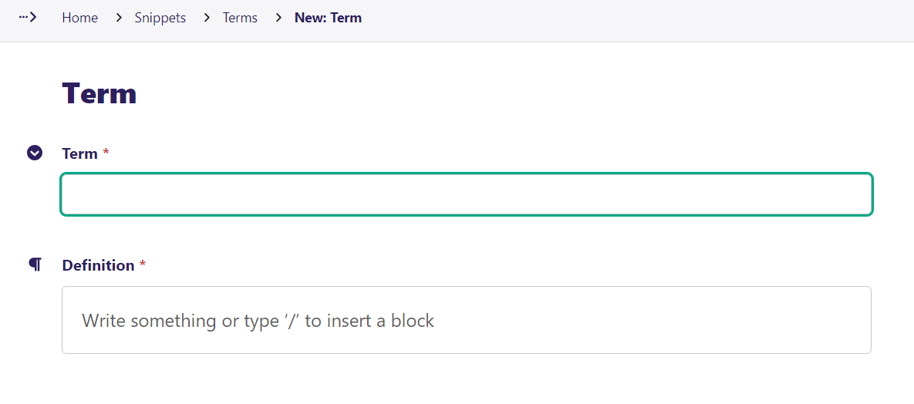
</p>
<p align="center" width="100%">
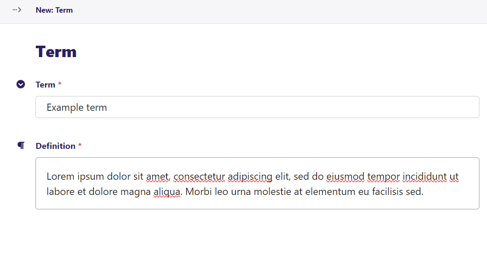
</p>

With tagging
<p align="center" width="100%">
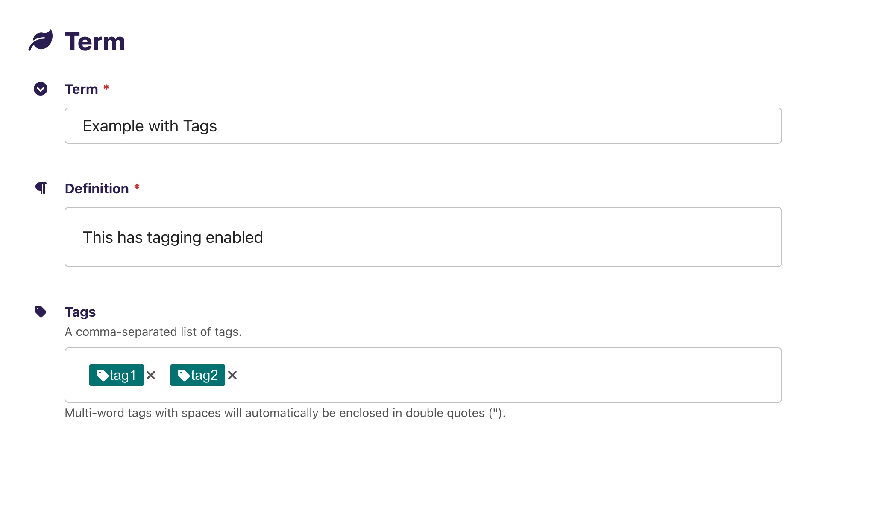
</p>

### Use term entity in editor

<p align="center" width="100%">
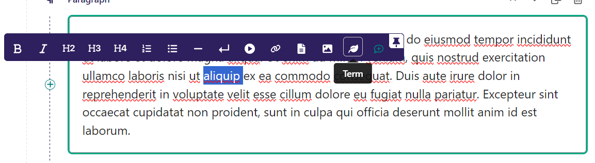
</p>

Search for term

<p align="center" width="100%">
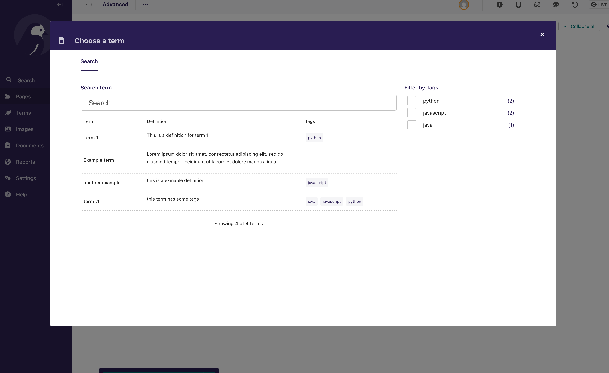
</p>
<p align="center" width="100%">
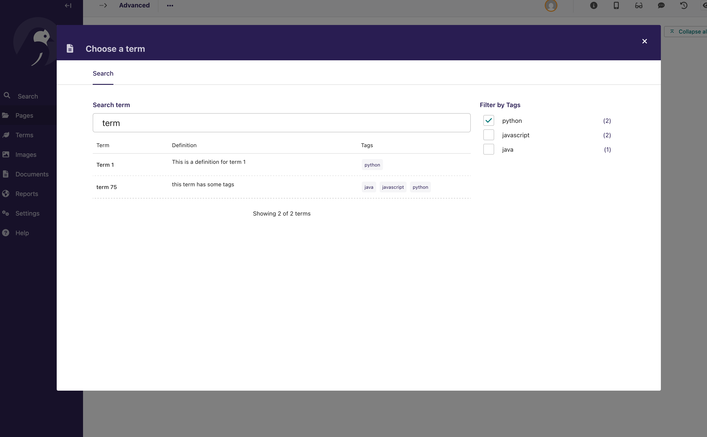
</p>

Select term

<p align="center" width="100%">
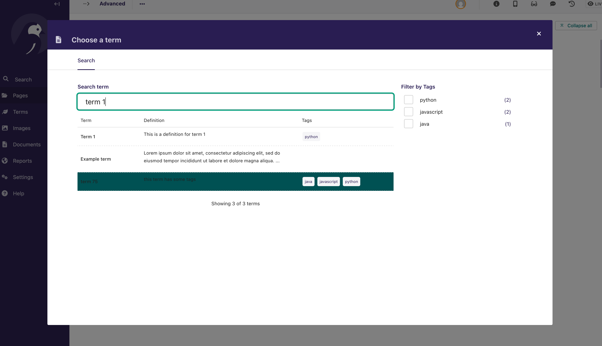
</p>

Without tags
<p align="center" width="100%">
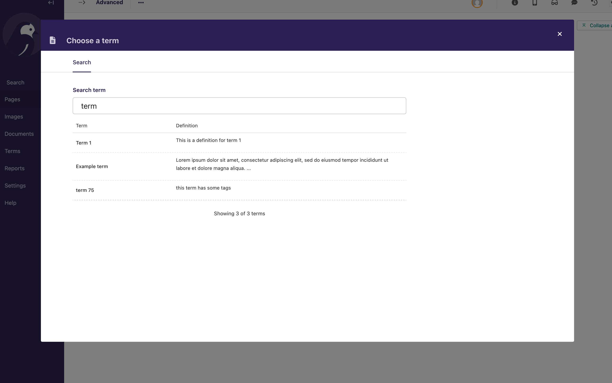
</p>
Entity displayed in editor

<p align="center" width="100%">
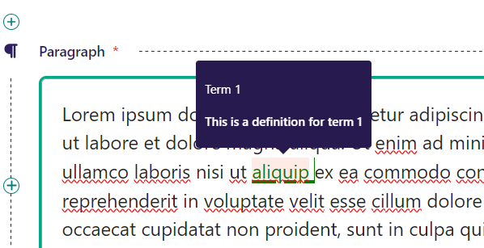
</p>

<p align="center" width="100%">
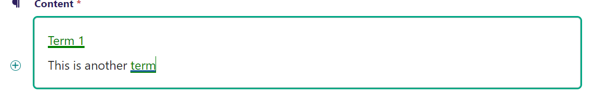
</p>

<p align="center" width="100%">
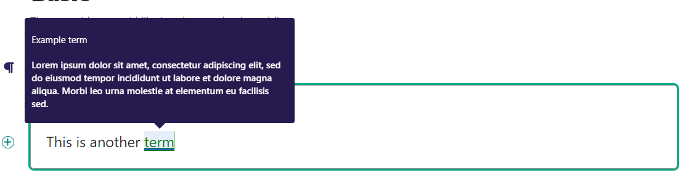
</p>

### Using Tags
Terms can be tagged to help organize and filter them. When creating or editing a term, you can add tags to categorize it. In the term selector popup, you can:

1. Filter terms by tags using the "Filter by Tags" input
2. Search for tags by typing in the tag filter box
3. Select multiple tags to filter terms that have all selected tags
4. Remove tags by clicking on the tag chips

When hovering over a term in both the editor and frontend, tags will be displayed in the tooltip along with the term definition.

You can disable the tagging functionality completely by setting `disable_tags` to `True` in your WAGTAILTERMS settings:

```python
WAGTAILTERMS = {
    # ...other settings...
    'disable_tags': True,
}
```

This will remove the tag filtering interface from the term selector and hide all tag-related features.

The REST API responses include tags for each term when tagging is enabled:

```json
{
    "term": "example term",
    "definition": "<p>Definition here</p>",
    "id": 1,
    "tags": ["category1", "category2"]
}
```

### Search in the Page Editor
The search functionality in the admin interface integrates with Wagtail's built-in search backend. This means:

1. The search will use whatever search backend you have configured for your Wagtail site (e.g., database, Elasticsearch)
2. It searches across term names, definitions, and tags
3. The search respects Wagtail's search configuration settings and optimizations

### Display in template
To display the terms on the frontend the term shows up as a `<span>` element 
tag with a green underline and green text. In a future update this will be customizable. 
The element has a data-term  attribute that contains the term id. It is up to the developer to fetch
the term and definition to display it. To get the term by id fetch the term by id using the term API.

Rendered HTML of the term in the frontend:
```html
<span style="text-decoration-line: underline; text-decoration-color: green;text-decoration-thickness: 3px;color:green;" data-term="1">term 1</span>
```
ℹ️ Above is the default style but this can be modified in the settings.

#### Quick implementation: ([See full example](./example/home/templates/home/quick_start.html))

Include in the template at the bottom of the page template.
```html
...

```
ℹ️  This loads the advanced implementation in page template.

#### The most basic implementation: ([See full example](./example/home/templates/home/basic_page.html))
```javascript
function showterm(e){
    const termid = e.target.dataset.term
    fetch(`/api/terms/${termid}/`)
        .then(response=> response.json())
        .then(data => {
            alert(`term = ${data.term} \ndefinition = ${data.definition}`)
        })
}

for(const term of document.querySelectorAll('[data-term]')){
    term.onmouseover=showterm;
}
```
The page would look like this:

<p align="center" width="100%">
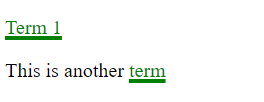
</p>

On hover
<p align="center" width="100%">
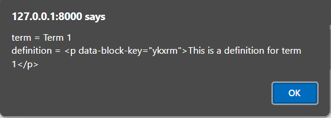
</p>

#### A more advanced way would be to use a library like [tippy.js](https://atomiks.github.io/tippyjs/) to 
create a tooltip that appears when hovering over the term. ([See full example](./example/home/templates/home/advanced_page.html))
```javascript
function add_tooltips(){
    const tips = tippy('[data-term]', {
        content: 'Loading...',
        allowHTML:true,
        interactive:true,
        theme:'light',
        animation: 'scale-subtle',
        onCreate(instance) {
            // Setup our own custom state properties
            // set if was loaded
            instance._fetchInitualized = false;
            instance._error = null;
        },
        onShow(instance) {
            if (instance._fetchInitualized || instance._error) {
                return;
            }

            instance._fetchInitualized = true;
            fetch(`/api/terms/${instance.reference.dataset.term}/`)
                .then(response => response.json())
                .then(data => {
                    if (data.term){
                        instance.setContent(`<h4>${data.term}</h4><p>${data.definition}</p>`);
                    }else{
                        instance.setContent("<p style='color: red'>Could not find definition</p>");
                    }
                })
                .catch(error => {
                    instance._error = error;
                    instance.setContent(`Request failed. ${error}`);
                });
        },
    });
}
add_tooltips();
```
The page would look like this:
<p align="center" width="100%">
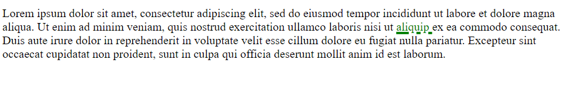
</p>

On hover
<p align="center" width="100%">
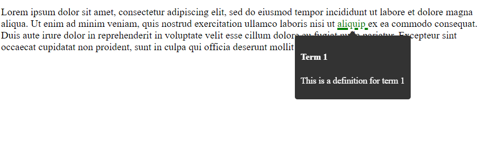
</p>

## REST API
### Terms Endpoints
`/api/terms/` will return a paginated list of terms. The response format depends on your `disable_tags` setting:

The list endpoint supports the following query parameters:
- `page`: The page number to retrieve (e.g., `/api/terms/?page=2`)
- `q`: Search terms by name and definition (e.g., `/api/terms/?q=example`)
- `tags`: Filter terms by one or more tags. Can be used multiple times to filter by multiple tags (e.g., `/api/terms/?tags=python&tags=django`)

When `disable_tags` is `False` (default):
```json
{
    "count": 3,
    "total_pages": 1,
    "current_page": 1,
    "next": null,
    "previous": null,
    "results": [
        {
            "term": "Term 1",
            "definition": "<p>This is a definition for term 1</p>",
            "id": 1,
            "tags": ["tag1", "tag2", "tag3"]
        },
        {
            "term": "Example term",
            "definition": "<p>Lorem ipsum dolor sit amet</p>",
            "id": 2,
            "tags": ["tag2", "tag4"]
        }
    ]
}
```

When `disable_tags` is `True`:
```json
{
    "count": 3,
    "total_pages": 1,
    "current_page": 1,
    "next": null,
    "previous": null,
    "results": [
        {
            "term": "Term 1",
            "definition": "<p>This is a definition for term 1</p>",
            "id": 1
        },
        {
            "term": "Example term",
            "definition": "<p>Lorem ipsum dolor sit amet</p>",
            "id": 2
        }
    ]
}
```

The list endpoint supports pagination through query parameters:
- `page`: The page number to retrieve (e.g., `/api/terms/?page=2`)
- Response includes:
  - `count`: Total number of terms
  - `total_pages`: Total number of pages
  - `current_page`: Current page number
  - `next`: URL for the next page (null if on last page)
  - `previous`: URL for the previous page (null if on first page)
  - `results`: Array of terms for the current page

Fetching a single term with `/api/terms/1/` will return:

With tags enabled:
```json
{
    "term": "term 1",
    "definition": "<p>this is term 1</p>",
    "id": 1,
    "tags": ["tag1", "tag2"]
}
```

With tags disabled:
```json
{
    "term": "term 1",
    "definition": "<p>this is term 1</p>",
    "id": 1
}
```

### Tags Endpoint
When tags are enabled (`disable_tags` is `False`), you can use `/api/terms/tags/` to get a list of all available tags:

```json
{
    "tags": [
        {
            "name": "tag1",
            "count": 5
        },
        {
            "name": "tag2",
            "count": 3
        }
    ],
    "hasMore": false
}
```

The tags endpoint supports pagination through the `page` query parameter:
- `/api/terms/tags/?page=1`
- Each tag object includes:
  - `name`: The name of the tag
  - `count`: Number of terms using this tag
- `hasMore`: Indicates if there are more pages of tags available

When tags are disabled (`disable_tags` is `True`), this endpoint will return a 404 response.

## Changelog

### 0.2.1
- Add Wagtail 7.2.x support
- Add Wagtail 7.1.x support

### 0.2.0
- Added tags support for terms
- Added tag filtering in term selector
- Added tags display in tooltips
- Updated REST API to include tags in responses
- Updated the picker UI to match the rest of the wagtail admin
- Tags filter uses infinite scroll
- Remove popup-js dependency
- Add pagination to the terms list
- Improve search to search terms and definitions
- Added `disable_tags` setting to completely disable the tagging functionality
- Add formal wagtail 7.0.x support

### 0.1.3
- Added setting to change frontend styles
- Added quick start template for default frontend implementation

### 0.1.2
- fixed term search form wider than modal
- Add dark mode support

### 0.1.1
- added settings to change the icon and menu order.
